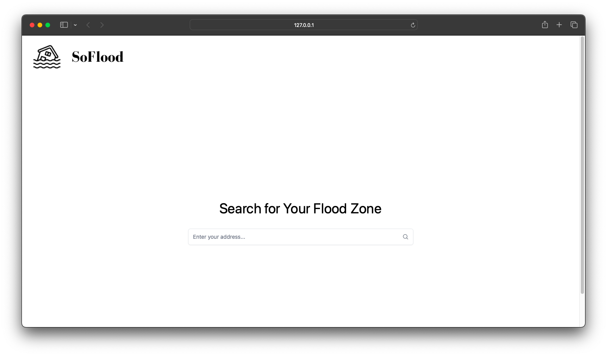
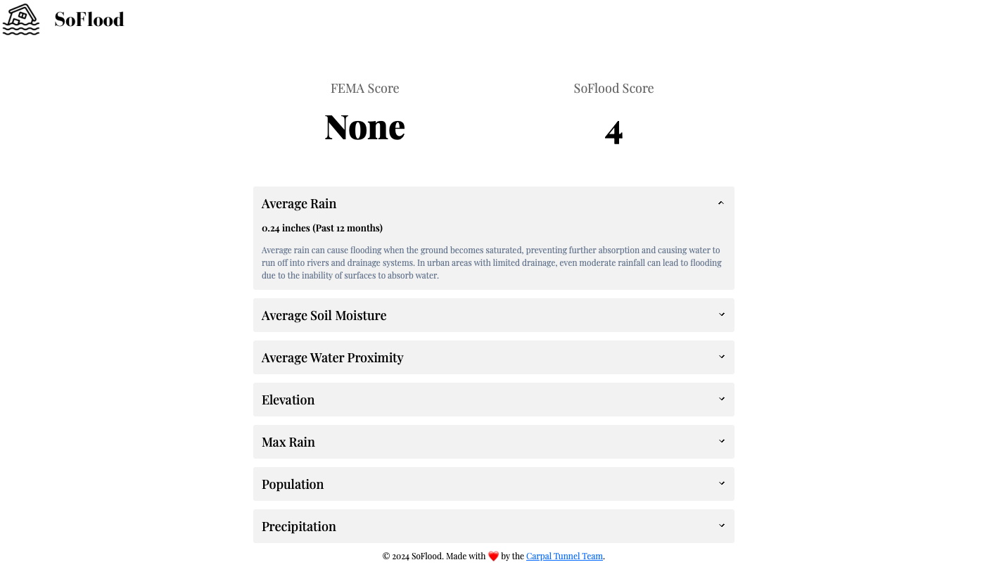

# So-Flood 

## Table of Contents
 * [Description](#Description)
 * [User-Story](#User-Story)
 * [Demo-Screenshots](#Demo-Screenshots)
 * [Presentation](#Presentation)
 * [Installation](#Installation)
 * [Usage](#Usage)
 * [Meet-The-Team](#Meet-The-Team)
 * [License](#License)

## Description

Welcome to So-Flood, a website that allows users to search for flood risk in their area. Users can search by zip code or address and will be presented with a map of their area with flood risk zones highlighted.  Users can also view a list of resources for preparing for and recovering from floods. So-Flood is a valuable tool for anyone who wants to be informed about flood risk in their area and take steps to protect themselves and their property, and use it as a resource to present it to their insurance companies to lower their home owner's' insurance. 

## User Story
As a homeowner, I want to be able to search for flood risk in my area so that I can be informed about the risk and take steps to protect myself and my property. I also want to be able to view resources for preparing for and recovering from floods so that I can be prepared in case of an emergency. In addition, I want to be able to share this information with my insurance company to lower my homeowner's insurance.

## Demo-Screenshots

## Presentation
Click the link below to view our presentation:
https://docs.google.com/presentation/d/17Gpmr5IV0yxHcELfcA5SLAnZl5rc2ipKj6ejtLbasEs/edit?usp=sharing

## Installation
Run the following commands to install the necessary dependencies:

`npm install` on one terminal

`pip install -r requirements.txt` on another terminal

run `npx tailwindcss -i ./static/css/input.css -o ./static/css/output.css --watch` on the first terminal 

run `python app.py` or `flask run` on the second terminal

## Usage
Enter your address and the flood results will be displayed on a seperate page.

## Meet-The-Team
The team members that contributed to this project are: 

 [`Leon Kipkoech`](leon.html)

 [`Elvis Hernandez`](elvis.html)

 [`Henrique Lopes`](henrique.html)

 [`Tina Humphrey`](tina.html)

## License 
This project uses the ISC License.